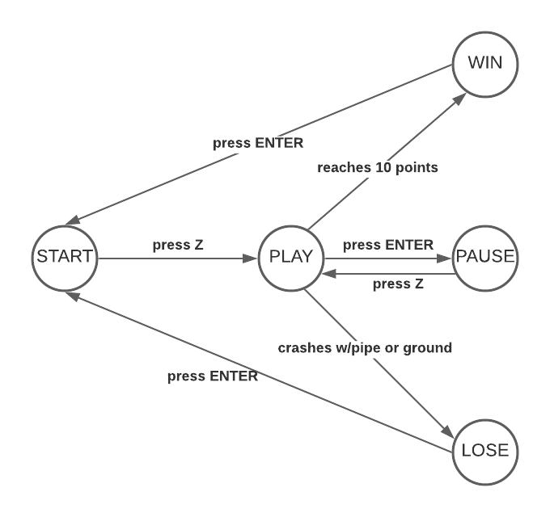

# Flappy bird's Readme  
## Program Structure  
El programa se fragmentó en 4 clases principales de acuerdo a los elementos en pantalla, estas clases son el main, Bird, Ground y el Pipe. Cada clase cuenta con sus métodos y funciones correspondientes los cuales son invocados desde la clase principal. Los nombres de las clases son descriptivos y evocan al objeto en cuestión. 

### Bird  

Nuestra clase declara al objeto que representa a nuestro player, y se compone de métodos sencillos, init, update, jump, collides y render , así como de un archivo .png que da la textura utilizada. 

Durante el método init se inicializa nuestro objeto, este cuenta con atributos de posición,  tamaño, y gravedad.  
El método update declara el estado del player durante el tiempo en el juego. En el flappy bird el único atributo que se actualiza es la posición en el eje ‘y’ del player, y esa se ve afectada por el valor de la gravedad. Sin un cambio externo, el player aumentará su posición en ‘y’.  

El método jump se utiliza cuando ocurre un estímulo externo declarado en la clase main (En nuestro caso, que se presione la tecla z), y su función es simple, siempre que la posición en el eje ‘y’ sea mayor a 0 (el jugador siga dentro de la ventana) se cambia la gravedad y esta hace disminuir la posición en ‘y’

El método collides recibe un objeto de tipo pipe para hacer referencia a sus posiciones, y devuelve un valor booleano que indica si se genero o no una colisión entre el objeto tipo pipe y el objeto Bird
Por último la función render, renderiza la imagen .png dado los atributos del objeto

### Ground    

Es una clase sencilla que consta únicamente de dos métodos, init y render. Su función es simple, inicializa un rectángulo según los atributos recibidos y renderizarlo.

### Pipe 

Es una clase sencilla, que cuenta con tres métodos, init, update y render, también utiliza un archivo .png de donde obtiene la textura del pipe,  y utiliza dos variables locales que rescatan las dimensiones de la textura y la disminuyen a un valor proporcional.  

El método init inicializa nuestro objeto con los atributos recibidos, estos son atributos de posición, dimensión, velocidad a la que las pipes se mueven, su orientación y un atributo de control. 

El método update disminuye la posición en ‘x’ de las pipes durante el tiempo a la velocidad del atributo de estas, lo que hace mover las pipes en dirección al player. 

El método render crea un sprite para redimensionar de forma correcta las dimensiones de la imagen que será textura de nuestro pipe, posteriormente dibuja en pantalla nuestra pipe ajustada al sprite creado previamente, de acuerdo a la ubicación de la pipe (superior o inferior) esta se dibujara con o sin alterar su rotación.

### Main

La clase main es el cuerpo de nuestro proyecto, en esta se recopilan objetos de las demás clases y se trabaja con ellos para conseguir el funcionamiento total. En esta clase se declaran los objetos que se utilizarán, en este caso un objeto de tipo Bird, 1 objeto de tipo ground y 4 objetos de tipo Pipe.

Main consta de cuatro métodos principales, load, update, keypress y draw.

Load se encarga de almacenar todos los archivos requeridos para el programa, es decir, archivos de audio, archivos de imagen, reclara las otras clases externas que se utilizarán, los objetos necesarios y sus parámetros si estos requieren de los mismos, declara variables de color, y dos funciones firstpipes y secondspipes las cuales actuan en forma de loop para generar pipes infinitos y con tamaños diferentes. 

Update controla la posición de los objetos creados en el tiempo dada ciertas condiciones, es lo que ocurre en pantalla mientras nos encontramos en el estado de ‘play’, verifica el estado de colisión, y controla el score del jugador. 

Keypress es un método que evalúa los estímulos externos de nuestro programa, en este caso solo hay dos posibles interacciones, ‘z’ y ‘enter’ donde el primero realiza diferentes acciones, cambia al estado ‘play’ o  llama al método de jump del objeto creado a partir de la clase Bird,  mientras que ‘enter’ tan solo es un estado de ‘pausa’ del juego o reinicia el juego en caso de que este haya terminado.  

El método draw se encarga de dibujar toda la información que apreciamos en pantalla y evocar al renderizado de los objetos. 

## State Machine  

En el estado START, el jugador está preparado para jugar, pero todavía no inicia el juego. Para poder iniciar, debe presionar la tecla z, lo que iniciará el juego, pasando al estado PLAY. Si el jugador opta por pausar el juego, presiona ENTER. El juego se congelará, pasando al estado PAUSE. Cuando el jugador quiera reanudar, debe presionar z, pasando de nuevo al estado PLAY. 

Si el jugador choca con una tubería o con el piso, el juego acaba y se pasa al estado LOSE. Aquí se muestra la puntuación final del jugador. Si se quiere volver a jugar, se debe presionar la tecla ENTER. Si esta se presiona, se pasará al estado de START y el jugador estará de nuevo listo para jugar. Si se está en estado PLAY y el usuario no choca y logra llegar a los 10 puntos, el jugador gana y se pasa al estado WIN. Si se quiere volver a jugar, es necesario presionar ENTER. Si esta se presiona, se regresará al estado START. 

